This document is prepared to help Product Specialists to be able to do Functional Review for Rates APIs.

# Contents
- [Introduction to Rates APIs](#introduction-to-rates-apis)
  * [Http Request and Response Structure](#http-request-and-response-structure)
  * [What is Rates APIs](#what-is-rates-apis)
- [Introduction to Bruno](#introduction-to-bruno)
- [Installing Bruno](#installing-bruno)
- [Import Rates APIs Tests Collection](#import-rates-apis-tests-collection)
- [Getting Familiar with Tests Collection](#getting-familiar-with-tests-collection)
  * [Validation Tests](#validation-tests)
- [Getting Familiar with Tests Collection](#getting-familiar-with-tests-collection)
- [Running Tests](#running-tests)
  * [Authentication in Rates APIs](#authentication-in-rates-apis)  
  * [Running a Single Test](#running-a-single-test)
  * [Running Multiple Tests Together](#running-multiple-tests-together)
- [API Result Format](#api-result-format)
- [Final Words](#final-words)

## Introduction to Rates APIs
Basically, you can consider an API as a function; You provide an input and call the function and then you will receive the output.

In our case, Rates APIs are a set of Web APIs, which means to call those APIs you need to send an HTTP Request to a particular Web Server via a URL (Uniform Resource Locator). 

### Http Request and Response Structure

An HTTP Request or response can simply be considered as a message (and it is actually a text message). So you send a message to a server (by using a tool) and receive a response accordingly. 

This message has a structure that we are going to describe very briefly. 
An HTTP message consists of these parts: 

**URL (Uniform Resource Locator)** : URL is simply the address of the function that you are going to call. 

**HEADER**: HTTP headers are attributes that let the client or the server to pass additional information with an HTTP request or response. For example if you want to say who is sending this request to server, you may put it into a header (There are some Http headers about authentication that will get familiar with, later). 

**BODY**: The actual data that you want to send via an HTTP message with reside in body. In our case, when we want Rates APIs to search for Costing rates, we will send a Query (RateQuery) to specify what rates we are looking for. We will put that RateQuery in HTTP message's **body**.

**VERB (or method)**: The verb actually tells about the desired action to be performed for a given function (or resource). It is not too important in our case. You should just know that there is something called VERB that we should specify for each HTTP request. List of verbs are : GET, HEAD, POST, PUT, PATCH and DELETE. In Rates APIs we only use PUT and sometimes GET. 

**HTTP response status code**: Status code of the response, indicates if the request has been fulfilled or not. You can see the list of HTTP Status codes and their meanings [here](https://www.w3.org/Protocols/rfc2616/rfc2616-sec10.html).

If you are interested to know more about an http messages you can find more information [here](https://developer.mozilla.org/en-US/docs/Web/HTTP/Overview).

To be able to check the functionality of Rates APIs, you should be able to prepare some HTTP Requests, and then send those requests to a specific address (URL) and then check the response accordingly. In the rest of this document, we are going to describe how you can run this workflow and check the functionality of Rates APIs.

### What is Rates APIs
Rates APIs is a web application. It is a software that can serve HTTP requests and send responses back to you.
Here are some QAs that may help you to understand Rates APIs better.

**What is the purpose of Rates APIs?** This application has been designed, so that other software applications can use it for two major purposes : **Searching Rates** and **Calculating Charges**.

**How you can interact with Rates APIs?** As a human, you can use some tools to interact with this application. It does not have a UI (like what CargoWise has) so  you can use it though that UI. We will introduce some tools that you will use them to interact with Rates APIs later. 

**What is the relation between CargoWise and Rates APIs?** Rates APIs, will connect to CargoWise Database and also  will use CargoWise itself for searching rates or calculating charges. It acts as an interface between CargoWise and outside world to provide some Rating functionality to others.

**How can I install Rates APIs locally?** Rates APIs is part of CargoWiseOne Web Server Components and can be installed locally by using this [guide](https://myaccount-portal.cargowise.com/my-account/Documents/UpdateNotes/CargoWiseOneUpdateNote20141115.pdf). Although almost you never will need to install it locally, because normally Rating Developers will provide the TestRig for you. 

**How can I access Rates APIs TestRig?** Basically, when you want to work with Rates APIs, you need both an instance of CargoWise and also an instance of Rates APIs that should be connected to your CargoWise instance. So, you should be provided by a CargoWise instance in SAND and the base URL of Rates APIs.

**What is the base URL of Rates APIs?** Each of Rates APIs has its own url, but all URLs consists of two parts : Base URL that is actually the address of Rates APIs web application, and a suffix that indicates what API you are calling. When you want to do functional review for Rates APIs, the base URL will be provided by development team. If you type the base URL of Rates APIs in your web browser, you should see something like this, in your browser : 

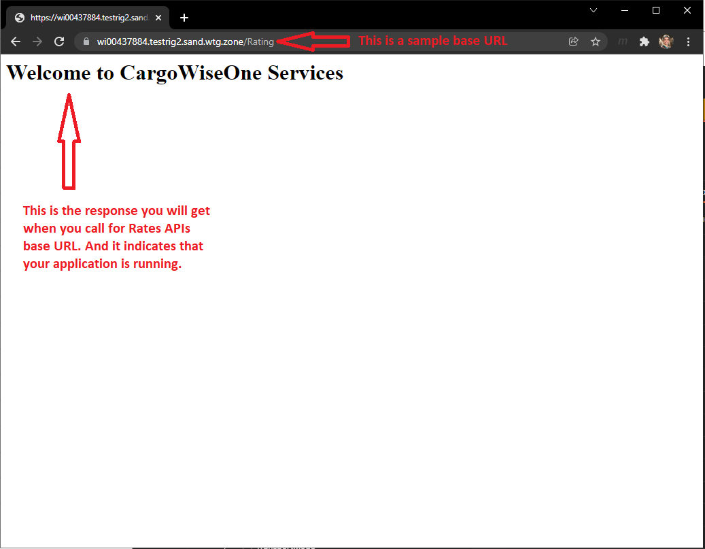

## Introduction to Bruno

To be able to call a Web API, you will need a tool (called a client). One of the most popular clients that can be used is your web browser (like Chrome). 
Your web browser is capable to send HTTP requests to web servers and receive the response and it is capable to show the response as well. But actually, web browsers are not very handy to prepare customized HTTP Requests. What we are going to use, is a tool that is specifically designed to work with Web APIs by being able to prepare customized HTTP requests, sending them to web servers and receiving the response. This tool is called Bruno. Bruno will be the main tool for checking the functionality of Rates APIs. 

## Installing Bruno

You can download Bruno from https://www.usebruno.com/downloads

Select the appropriate version based on the operating system of your computer and then download and install it. This will most likely be Windows x64

After installation please go to settings and ensure that SSL certification verification is OFF. 

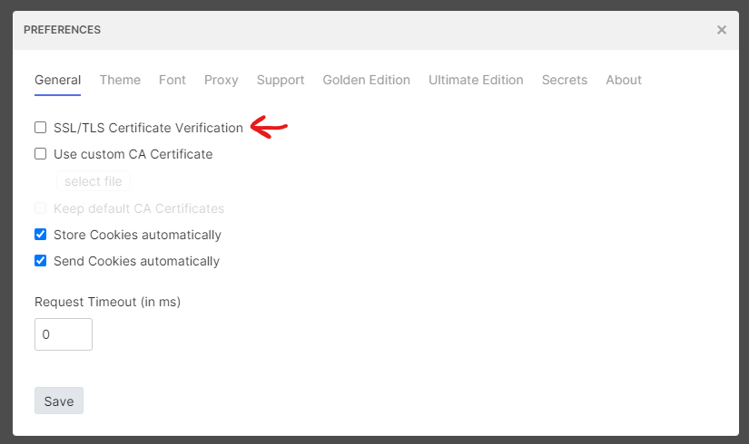

## Import Rates APIs Tests Collection

After you install Bruno, it you run that application, you will probably see an application like this: 

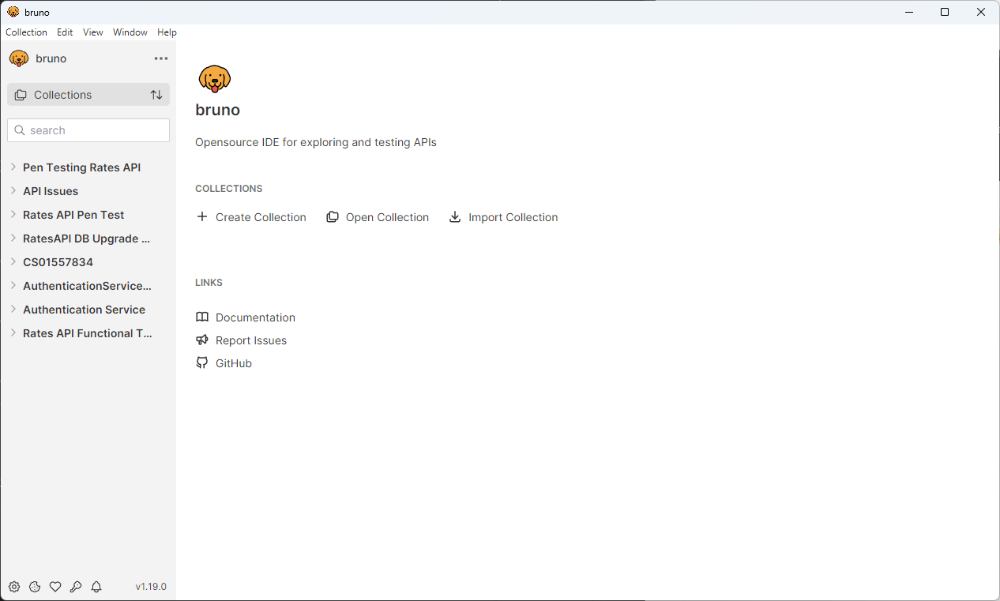

The good news is that, we have prepared a platform in Bruno, so you can test Rates APIs functionality with little technical background. 

To do so, we have created a collection of tests (actually a collection of pre-defined HTTP requests) that will help you through testing process. 

The first step to start is to import that collection of tests into Bruno. You should download and save the list of tests from [here](https://devops.wisetechglobal.com/wtg/CargoWise/_git/Dev?path=%2FEnterprise%2FProduct%2FOperations%2FRating%2FWeb%2FFunctionalReview%2FRates%20API%20Functional%20Tests&version=GBIWR%2FWI00676458-migrate-rates-api-samples-from-postman-to-bruno-2&_a=contents) into your computer. Note that **you need to save the entire set of files in this location!** To do this, navigate to the "three dots" menu near the top-right corner and select "Download as Zip":

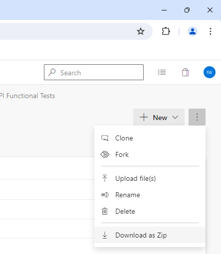

Unzip the downloaded file.

Then please import that file into Bruno by selecting the "Open Collection" option on screen:

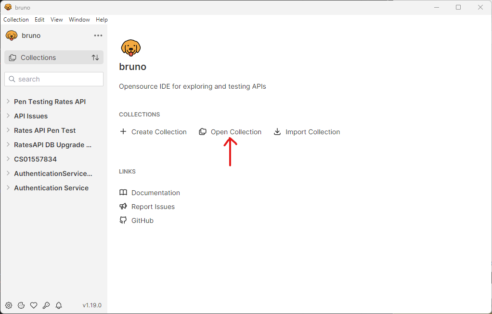

Navigate to the location of the unzipped collection. And select the "Rates API Functional Tests" folder. It's the folder that contains the subfolders for "environments", "Token", "XML", etc:

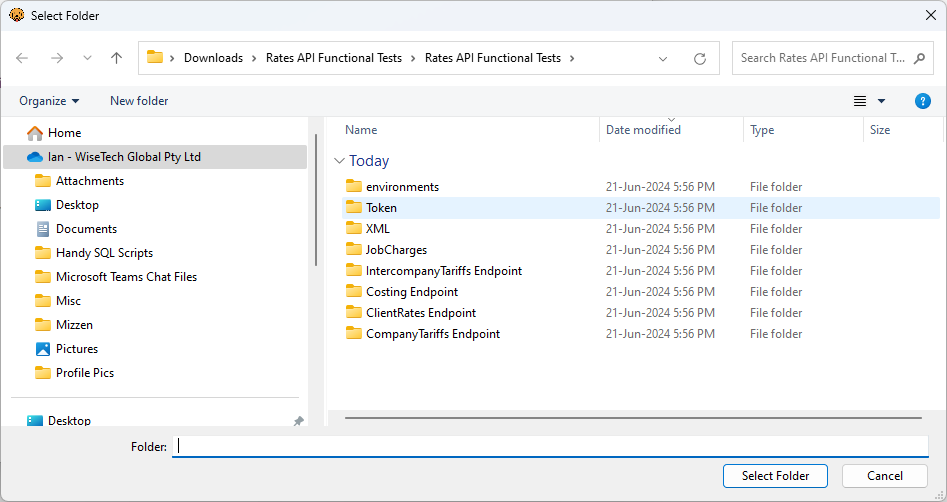

After you finish the import, then you should be able to see the List of tests like the image below. We will get into how to use this collection of tests shortly. 

After you finish the import. In the collections list on the left-hand sidebar, you should see the collection "Rates API Functional Tests", which if expanded shows a number of sub-groups:

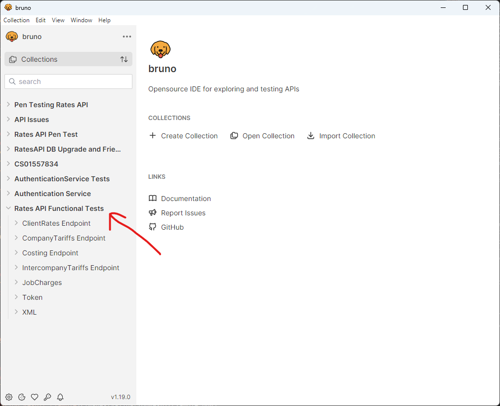

In newer versions of Bruno you may be prompted about the security level of the collection. It defaults to 'Safe Mode', but **you must select 'Developer Mode'**. The requests in the collection rely on scripts that can only work in Developer Mode.

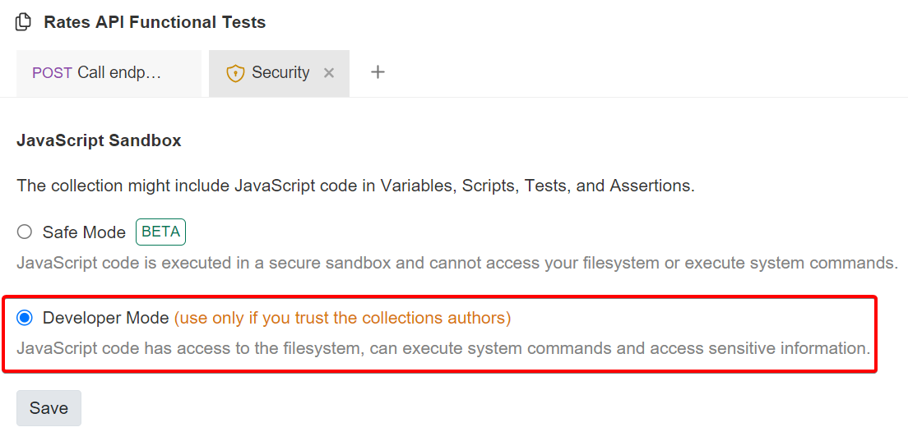

## Getting Familiar with Tests Collection
Now that you have imported the tests, we should understand what are these tests, what is the purpose of them, and how we can run them. 
This collection is a list of predefined tests, which we think they are necessary to be checked to ensure that Rates APIs are working correctly. 
Are these tests adequate? We don't think so. But they are a good starting point. 

We have divided this collection into two major parts:

### Validation Tests
Basically, when you pass an **input** to a function, that input should be correct (according to specifications).
What we do in Rates API is that we check the input that a client send to us, and will inform the client if there are some problems with that input. 
And we call this: input validation. 

What is that input by the way? According to Rates APIs Specification ([Link will be provided when update note is published]()) when you call one of Rates APIs, you should provide an structure called **RateQuery**.
If provided RateQuery is not according to specification, then when you call an API you will receive some messages that indicate what is the problem with the input you have provided. 

Let's share an example to make this more clear. Consider that we send an HTTP request that its Body is a RateQuery as following: 

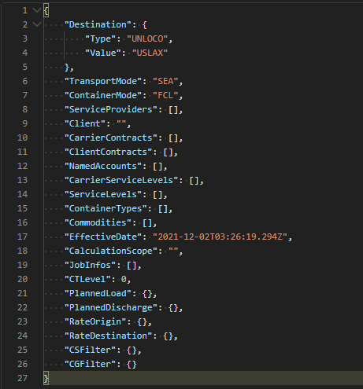

As you can see, in this example, we have not provided the "Origin", and based on the Specification, providing the "Origin" is mandatory. So we expect to receive a response that indicates this error. Actually the response **body** in this case will be the following structure, and the HTTP status code will be 400 which indicates that you have send a BAD REQUEST.

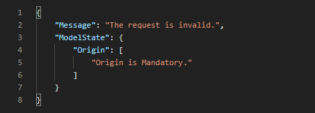

### Other Predefined Tests
Other than validation tests, we also have prepared some tests that can mostly be used as a Template. 
You can use these templates fo facilitate your Functional Review job. 

For example think that you want to call costing API, with providing mandatory information and also some container types to do more filtering for the costings. You can use the predefined test to do so. 

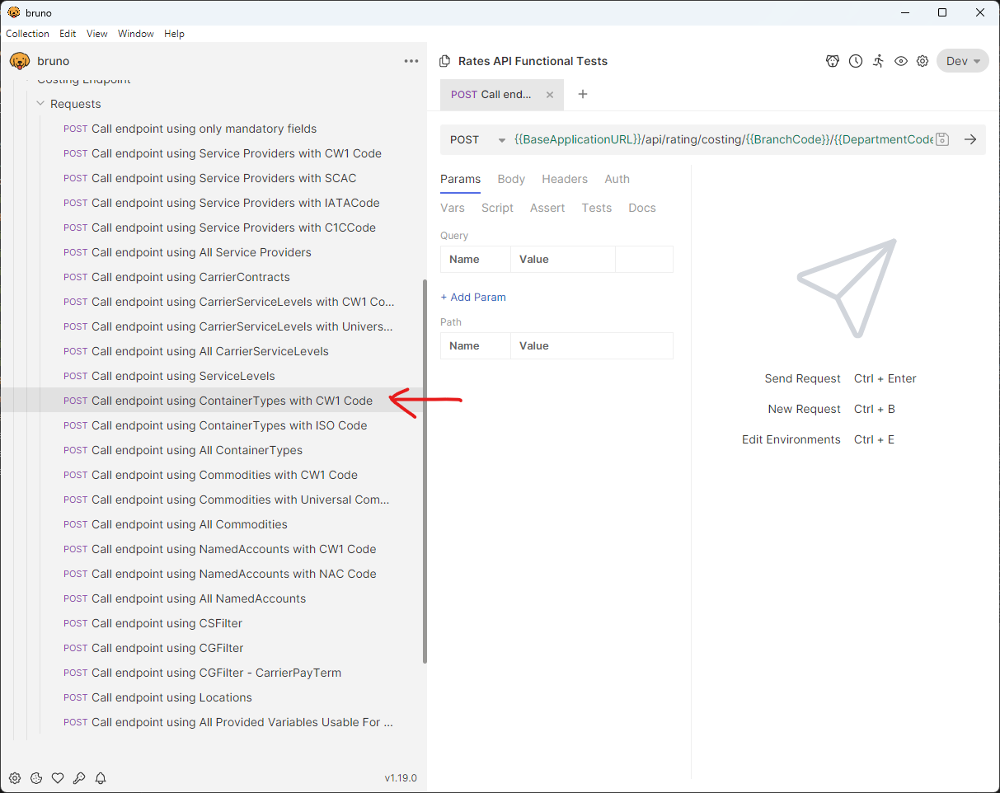

### Collection Variables
Although we have provided some pre-defined tests, those tests can not be run until you specify some information.
For example, you should specify the base URL, so we know where to send the requests and get the responses. 
To get the required information from you, we have defined some variables for this collection, that you should specify them. 

To be able to see those variables and set their values, you msut first select an "environment", which is a collection of variables and their values. You may create separate environments for Dev, SAND, and Production, for for instance.

Select your environment from the drop-down in the top-right corner:

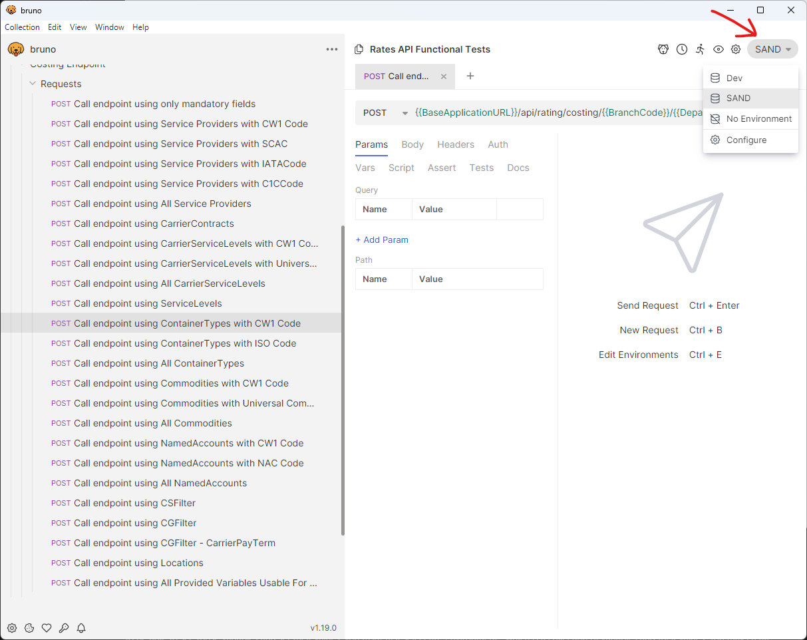

Once you have chosen your environment, you can configure the associated variables by selecting "configure" from the menu

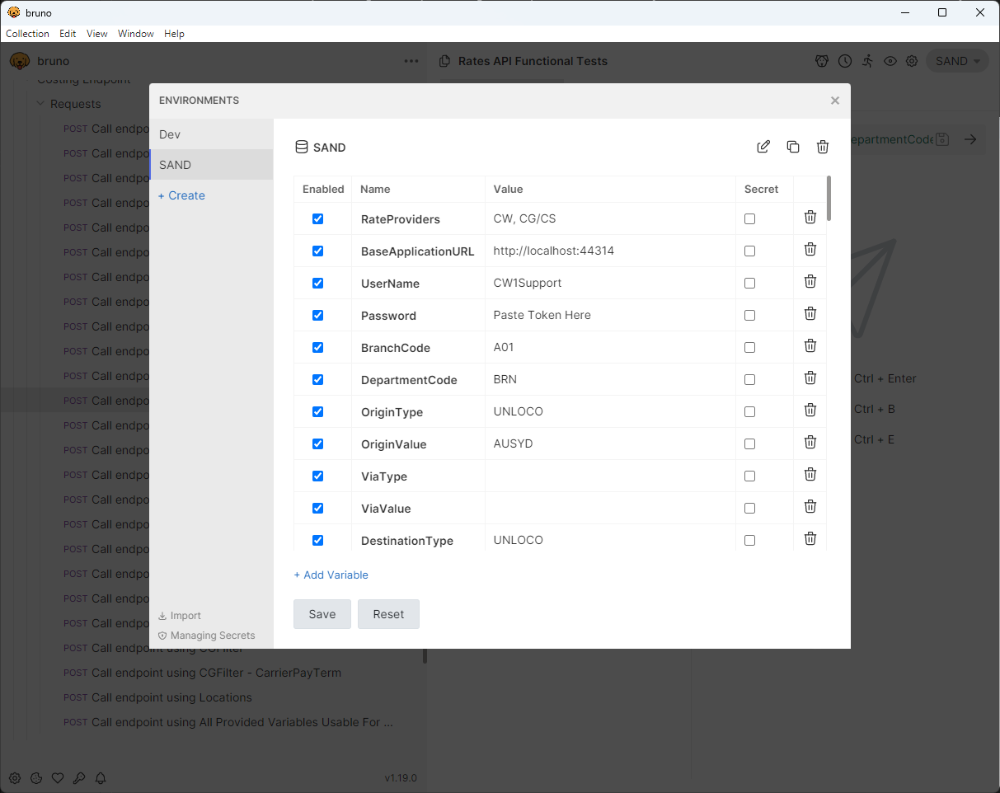

When you change the current value of a variable, you should **save** your changes. Otherwise this new value will not be used when you run tests.

If you want to put an empty value between other values, you can use an space separated by comma. For example for Service Level it can be like: `STD,DIR`

### Note for Devs - Saving Changes to Environment Variables

Please be mindful that any changes made to Bruno Environment variables will be saved to the corresponding file within the Bruno collection, eg: `environments/Dev.bru`. For developers, that means any time you change a variable like the CWSupport password, it will naturally show up in Git diffs. **Please be sure to inspect any diffs to these files and only commit changes that genuinely relate to your work-item**.

## Running Tests

Now it is time to run the tests and analyze the results. Each test is actually a HTTP request that we send to the Base URL that you already specified in the Environment Variables, and the result would be an HTTP response that we expect it to comply with Rates APIs specification. For example, we expect the HTTP Status of an specific test to be 400 and in the body of the response, we expect to receive a message that indicate the reason for that.

### Authentication in Rates APIs
Before diving into running tests, we need to describe how authentication works in Rates APIs.
If you want to call an API, you need to have CW1 username/password. You should specify your CW1 username/password in Environment Variables as below:

Note: You can authenticate using the CWSupport user once you refresh the password via ediProd -> Help -> Support Token. This will copy the password to your clipboard.

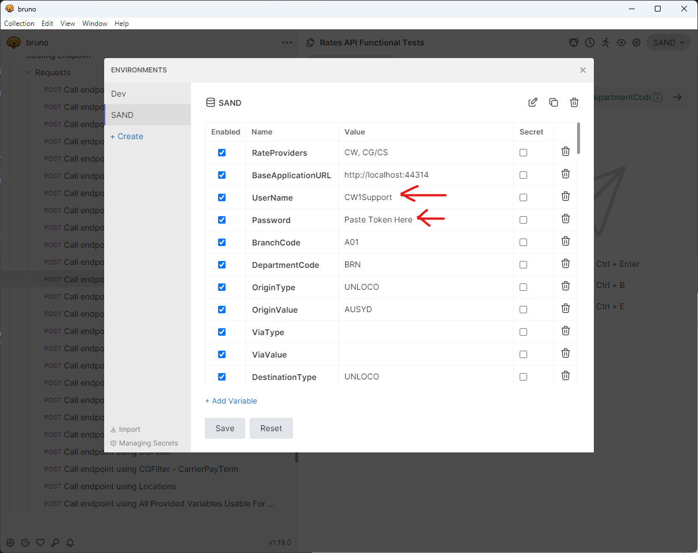

Based on Rates APIs HLD, before asking for an API, you should send an HTTP request to Rates APIs web application to get a **Token** to be able to call other APIs. 
But we have automated this process in Rates APIs Bruno collection. It means that, before sending requests, we **automatically** send another request to Rates APIs to get a token. We also **automatically** put that token in your HTTP Request as an HTTP Header, so your request can be authenticated by Rates APIs web application. 

Please be noted that if you provide an invalid CW1 username or password, then we can not get appropriate token for your Http Request, and thus your HTTP request will not be authenticated and you will receive an error.

### Running a Single Test

Before you start to run a test, ensure that your variables has desired values and you have saved your changes. 
To run a test, you should click on it, and a new windows will be opened that you can run the test (send the HTTP request) and view the result (HTTP response). For some of tests, we already have written some scripts to check some expectations, and you can see if those expectations has been met or not. 
You can see an example in the following pictures: 

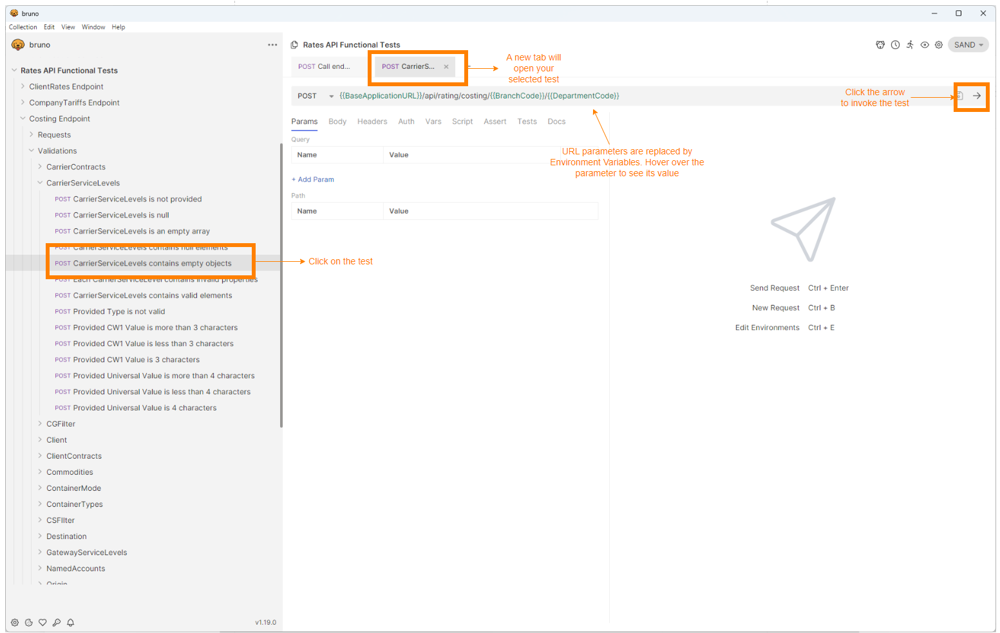

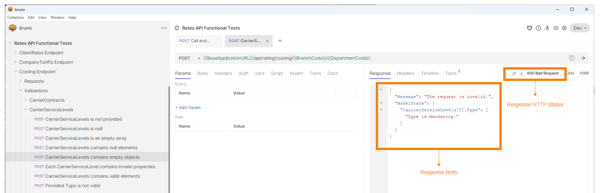

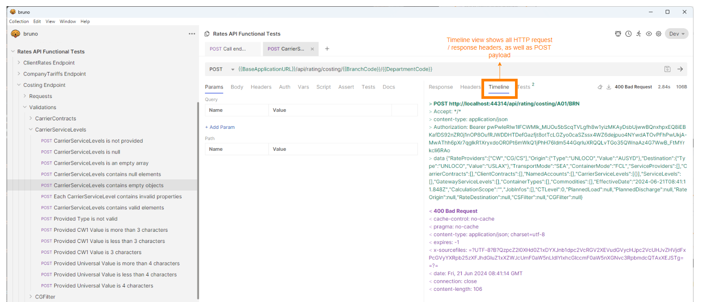

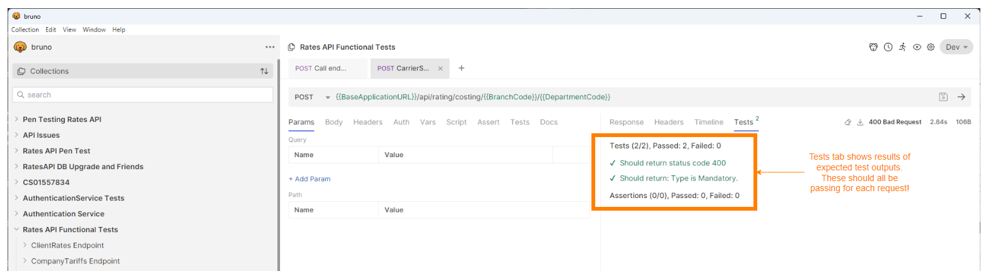

### API Result Format
When a client sends a http request to a server, it can specify the format of response that is appreciate for it to process.
 
Rates APIs can provide two format for data that it returns : XML and JSON. XML is the default format that Rates APIs is working with, but it also can be configures to work with JSON as well. 

A client can specify the data format, but adding a HTTP header to its request called "Accept". There are numerous types that can be chosen as a value for Accept http header. Those values are called "Media Type".

In the following pictures you can see, how you an specify a format for your request in Bruno: 

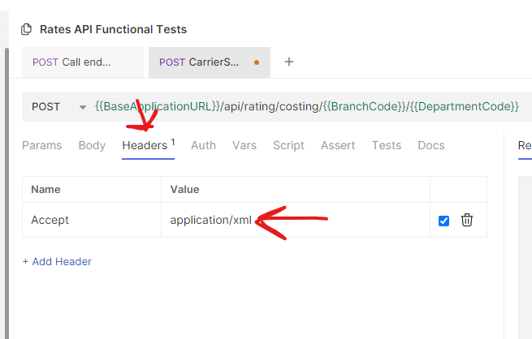

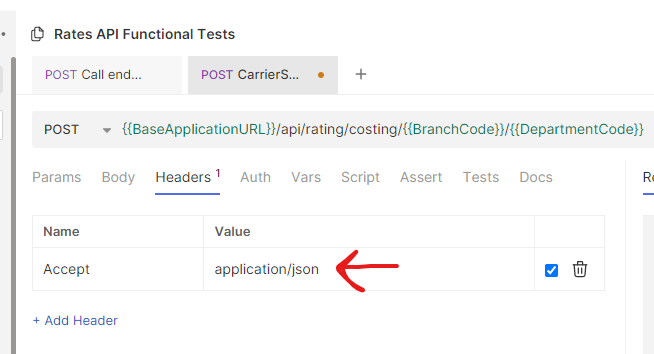

## Final Words

In this document, we tried to explain what is necessary to start working with Rates APIs and doing a functional review using Bruno and predefined Bruno collection. If you have any suggestion regarding this document, or you think more tests should be added to Rates APIs Bruno Collection, then please send feel free to contact the Rating development team.
