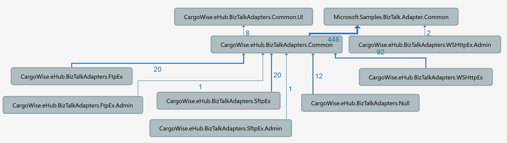

# CargoWise.eHub.BizTalkAdapters.Common

This is the core library for the current custom adapter framework. The FTPEx, SFTPEx, WSHTTPEx, and Loopback adapters currently use this framework.

## Project Dependencies

## To Do
* Convert adapters to use the new [Transferrer framework](..\Transferrer.Core\readme.md)  
  * After adding the required transport support to the new Transferrer framework (e.g. `CargoWise.eHub.BizTalkAdapters.Transferrer.Ftp` for FTP) an existing adapter should be able to be changed to use the new framework by just changing its base class.  
* Move `CargoWise.eHub.BizTalkAdapters.Common.UI` to new Transferrer framework.  
  * This library is currently being referenced by both the old and new frameworks so once all the old adapters have been converted to the new framework and the `CargoWise.eHub.BizTalkAdapters.Common` library has been deprecated it can be moved to the new namespace.
