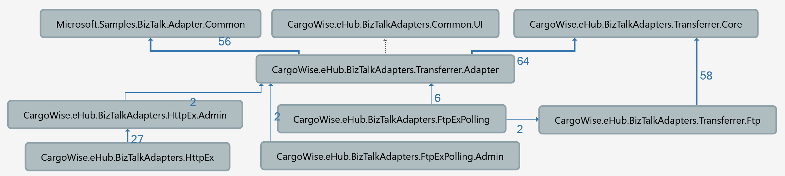

# CargoWise.eHub.BizTalkAdapters.Transferrer.Core

A new framework for hosting custom BizTalk adapters.  

The benefits of this new framework are:
* Improved asynchronous processing by migrating from .NET 4.0 TPL design to .NET 4.5 TAP async/await design  
* Removal of dependancy to BizTalk assemblies in Core and transport libraries
* Support for dynamic polling adapters

## Project Dependencies

## To Do

* Fix handler setup so that default configuration is automatically set on install
* Change design of polling adapter to remove batching:  
  * When the polling adapter receives the initial credentials message, instead of downloading and batching files it should instead return a message that is an envelope containing the listing details for all the selected server files
  * This message should be de-enveloped in the receive pipeline (built-in XmlReceive pipeline should be used) and the body messages sent to another FTPExPolling send-receive port
  * When the adapter receives a message on this second send-receive port, it should detect that the message type is a file download request instead of a polling request and download the file directly
  * The receive process will need to ignore messages for files that no longer exist whcih will require handling in the pipeline because a send-receive adapter must alway return a response to BizTalk
* Improve TAP design to provide more reliable cancellation
* Add integration tests
* Add transport handlers for: 
  * SFTP
  * HTTP
    * Convert HTTPEx adapter to use
  * SOAP
* Convert old adapters to use new framework
