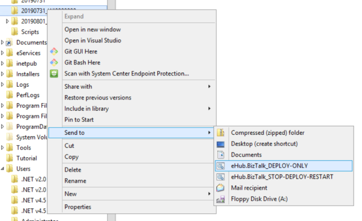

# Deploy Scripts

## Production

### 'SendTo' Shortcuts

You can copy shortcut files from `C:\Deploy\Scripts` to `%APPDATA%\Microsoft\Windows\SendTo` to allow you to deploy from folder context menus.

**If you only ever do weekday deployments then only copy the DEPLOY-ONLY shortcut.**

